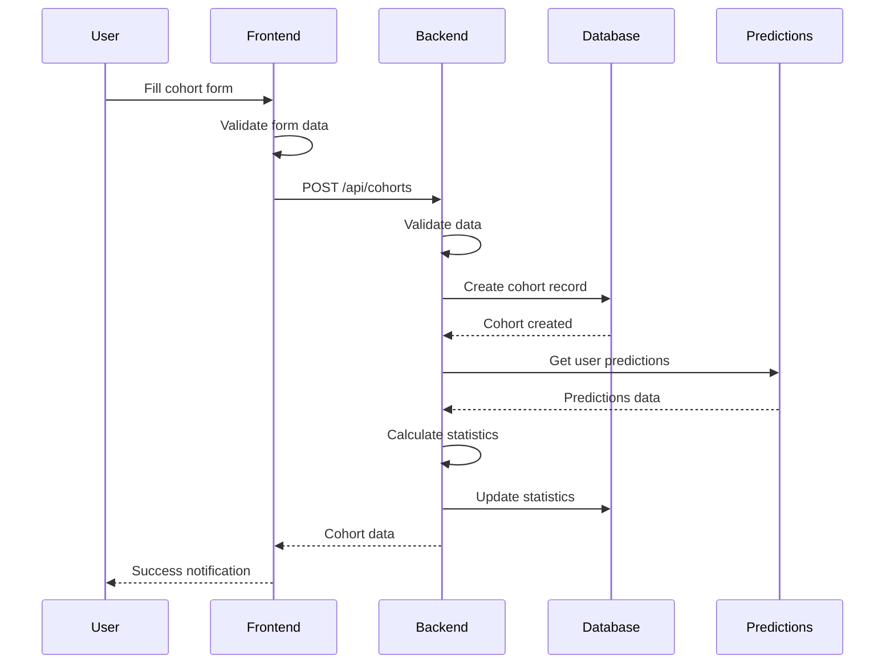
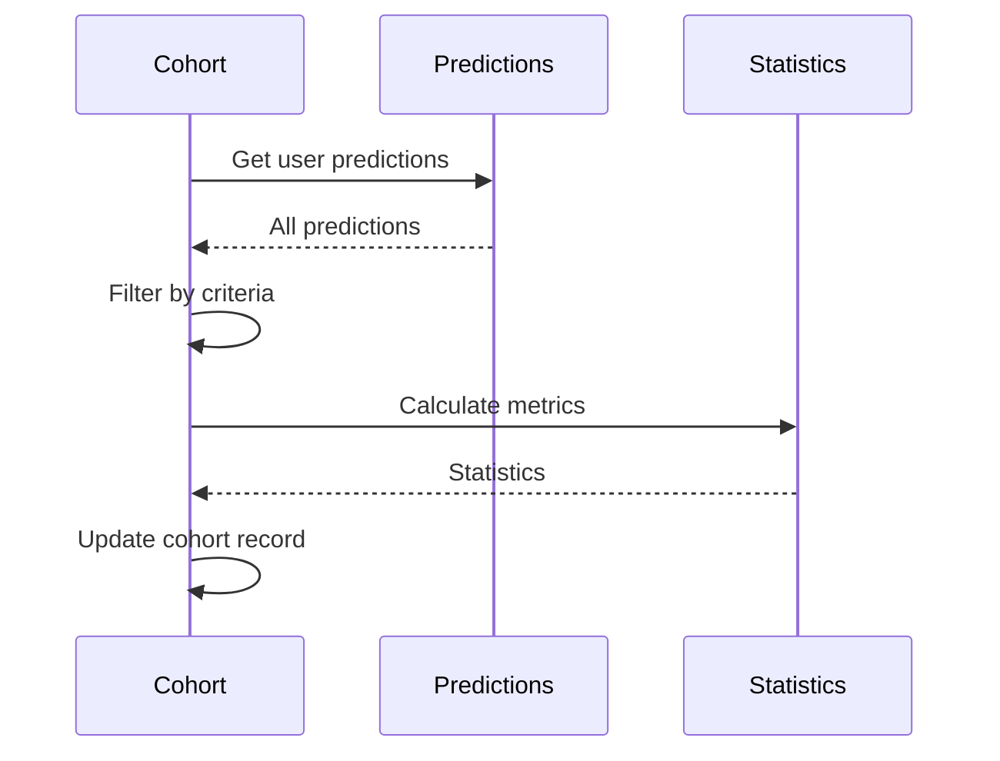

# Customer Cohorts System Documentation

## Overview

This document describes the comprehensive customer cohorts system that allows users to create, manage, and analyze customer segments based on behavior patterns, engagement levels, and churn risk. The system provides a complete CRUD interface with filtering capabilities and real-time statistics.

## Features

- **Cohort Management**: Create, edit, and delete customer cohorts
- **Advanced Filtering**: Filter by engagement level, churn risk, and numeric ranges
- **Real-time Statistics**: Automatic calculation of cohort metrics
- **User-specific Data**: Each user can only access their own cohorts
- **Dashboard Integration**: Cohorts displayed in card format on the dashboard
- **Search and Filter**: Advanced search and filtering capabilities

## Architecture

### Backend Components

#### 1. Database Model (`backend/models/cohort.py`)

**Cohort Model**:
```python
class Cohort(Base):
    __tablename__ = 'cohorts'
    
    id = Column(Integer, primary_key=True)
    user_id = Column(Integer, ForeignKey('users.id'))
    name = Column(String(255), nullable=False)
    description = Column(Text, nullable=True)
    
    # Criteria fields
    engagement_level = Column(String(50))
    churn_risk_level = Column(String(50))
    min_age = Column(Integer)
    max_age = Column(Integer)
    # ... other range fields
    
    # Statistics (calculated)
    total_customers = Column(Integer, default=0)
    avg_churn_score = Column(Float, default=0.0)
    high_risk_count = Column(Integer, default=0)
    medium_risk_count = Column(Integer, default=0)
    low_risk_count = Column(Integer, default=0)
```

**Key Methods**:
- `to_dict()`: Convert cohort to dictionary format
- `update_statistics()`: Calculate and update cohort statistics
- `filter_predictions()`: Filter predictions based on criteria
- `create_from_data()`: Create cohort from form data

#### 2. API Routes (`backend/routes/cohort_routes.py`)

**Endpoints**:
- `GET /api/cohorts` - Get all user cohorts
- `POST /api/cohorts` - Create new cohort
- `GET /api/cohorts/{id}` - Get specific cohort
- `PUT /api/cohorts/{id}` - Update cohort
- `DELETE /api/cohorts/{id}` - Delete cohort (soft delete)
- `POST /api/cohorts/{id}/recalculate` - Recalculate statistics
- `POST /api/cohorts/filter` - Filter cohorts

### Frontend Components

#### 1. CohortCard Component (`frontend/components/cohorts/CohortCard.tsx`)

**Features**:
- Display cohort information and statistics
- Risk distribution visualization
- Action buttons (edit, delete, recalculate)
- Criteria tags display
- Responsive design

#### 2. CohortForm Component (`frontend/components/cohorts/CohortForm.tsx`)

**Features**:
- Modal form for creating/editing cohorts
- Form validation
- Numeric range inputs
- Level selection dropdowns
- Real-time validation feedback

#### 3. CohortsSection Component (`frontend/components/cohorts/CohortsSection.tsx`)

**Features**:
- Main cohorts management interface
- Search and filtering
- Grid layout for cohort cards
- CRUD operations
- Toast notifications

## Data Flow

### 1. Cohort Creation Flow



### 2. Statistics Calculation Flow



## API Reference

### Cohorts Endpoints

#### Get All Cohorts
**`GET /api/cohorts`**

**Headers**:
```
Authorization: Bearer <access_token>
```

**Response**:
```json
{
  "success": true,
  "data": [
    {
      "id": 1,
      "user_id": 1,
      "name": "High Value Customers",
      "description": "Customers with high engagement",
      "criteria": {
        "engagement_level": "high",
        "churn_risk_level": "low",
        "age_range": { "min": 25, "max": 65 },
        "total_purchases_range": { "min": 10, "max": 100 }
      },
      "statistics": {
        "total_customers": 150,
        "avg_churn_score": 0.234,
        "high_risk_count": 15,
        "medium_risk_count": 45,
        "low_risk_count": 90
      },
      "created_at": "2024-01-01T12:00:00Z",
      "last_calculated": "2024-01-01T12:05:00Z"
    }
  ],
  "total": 1
}
```

#### Create Cohort
**`POST /api/cohorts`**

**Request Body**:
```json
{
  "name": "High Value Customers",
  "description": "Customers with high engagement and low churn risk",
  "engagement_level": "high",
  "churn_risk_level": "low",
  "min_total_purchases": 10,
  "max_total_purchases": 100,
  "min_avg_order_value": 50.0,
  "max_avg_order_value": 500.0
}
```

**Response**:
```json
{
  "success": true,
  "message": "Cohort created successfully",
  "data": {
    "id": 1,
    "name": "High Value Customers",
    "statistics": {
      "total_customers": 150,
      "avg_churn_score": 0.234
    }
  }
}
```

#### Update Cohort
**`PUT /api/cohorts/{id}`**

**Request Body**:
```json
{
  "name": "Updated High Value Customers",
  "description": "Updated description",
  "min_total_purchases": 15
}
```

#### Delete Cohort
**`DELETE /api/cohorts/{id}`**

**Response**:
```json
{
  "success": true,
  "message": "Cohort deleted successfully"
}
```

#### Filter Cohorts
**`POST /api/cohorts/filter`**

**Request Body**:
```json
{
  "engagement_level": "high",
  "churn_risk_level": "low"
}
```

#### Recalculate Statistics
**`POST /api/cohorts/{id}/recalculate`**

**Response**:
```json
{
  "success": true,
  "message": "Cohort statistics recalculated",
  "data": {
    "statistics": {
      "total_customers": 150,
      "avg_churn_score": 0.234,
      "high_risk_count": 15
    }
  }
}
```

## Frontend Implementation

### Cohort Form Data Structure

```typescript
interface CohortFormData {
  name: string
  description: string
  engagement_level: string
  churn_risk_level: string
  min_age: string
  max_age: string
  min_total_purchases: string
  max_total_purchases: string
  min_avg_order_value: string
  max_avg_order_value: string
  min_days_since_last_purchase: string
  max_days_since_last_purchase: string
  min_email_opens: string
  max_email_opens: string
  min_website_visits: string
  max_website_visits: string
}
```

### Cohort Card Display

```tsx
<CohortCard
  cohort={cohort}
  onEdit={handleEdit}
  onDelete={handleDelete}
  onRefresh={handleRefresh}
/>
```

### Search and Filtering

```tsx
// Search functionality
const [searchTerm, setSearchTerm] = useState('')

// Filter by engagement level
const [engagementFilter, setEngagementFilter] = useState('')

// Filter by churn risk level
const [churnRiskFilter, setChurnRiskFilter] = useState('')

// Apply filters
const applyFilters = () => {
  let filtered = [...cohorts]
  
  if (searchTerm) {
    filtered = filtered.filter(cohort =>
      cohort.name.toLowerCase().includes(searchTerm.toLowerCase())
    )
  }
  
  if (engagementFilter) {
    filtered = filtered.filter(cohort => 
      cohort.criteria.engagement_level === engagementFilter
    )
  }
  
  setFilteredCohorts(filtered)
}
```

## Criteria and Filtering

### Engagement Level Calculation

```python
def calculate_engagement_score(self, row_data):
    """Calculate engagement score based on customer data"""
    email_opens = row_data.get('email_opens', 0)
    website_visits = row_data.get('website_visits', 0)
    total_purchases = row_data.get('total_purchases', 0)
    
    # Weighted engagement score
    engagement_score = (email_opens * 0.3 + website_visits * 0.4 + total_purchases * 0.3)
    return engagement_score

def matches_engagement_level(self, engagement_score):
    """Check if engagement score matches the required level"""
    if self.engagement_level == 'high':
        return engagement_score >= 20
    elif self.engagement_level == 'medium':
        return 10 <= engagement_score < 20
    elif self.engagement_level == 'low':
        return engagement_score < 10
    return True
```

### Numeric Range Filtering

```python
def filter_predictions(self, predictions):
    """Filter predictions based on cohort criteria"""
    filtered = []
    
    for prediction in predictions:
        row_data = prediction.get('row_data', {})
        
        # Check age range
        age = row_data.get('age', 0)
        if self.min_age is not None and age < self.min_age:
            continue
        if self.max_age is not None and age > self.max_age:
            continue
        
        # Check total purchases range
        total_purchases = row_data.get('total_purchases', 0)
        if self.min_total_purchases is not None and total_purchases < self.min_total_purchases:
            continue
        if self.max_total_purchases is not None and total_purchases > self.max_total_purchases:
            continue
        
        # ... other range checks
        
        filtered.append(prediction)
    
    return filtered
```

## Statistics Calculation

### Cohort Metrics

```python
def update_statistics(self, predictions):
    """Update cohort statistics based on matching predictions"""
    matching_predictions = self.filter_predictions(predictions)
    
    if matching_predictions:
        self.total_customers = len(matching_predictions)
        self.avg_churn_score = sum(p['churn_score'] for p in matching_predictions) / len(matching_predictions)
        self.high_risk_count = len([p for p in matching_predictions if p['risk_level'] == 'high'])
        self.medium_risk_count = len([p for p in matching_predictions if p['risk_level'] == 'medium'])
        self.low_risk_count = len([p for p in matching_predictions if p['risk_level'] == 'low'])
    else:
        self.total_customers = 0
        self.avg_churn_score = 0.0
        self.high_risk_count = 0
        self.medium_risk_count = 0
        self.low_risk_count = 0
    
    self.last_calculated = func.now()
```

### Risk Distribution Visualization

```tsx
<div className="flex h-2 bg-gray-200 rounded-full overflow-hidden">
  <div 
    className="bg-red-500 h-full"
    style={{ 
      width: `${(cohort.statistics.high_risk_count / cohort.statistics.total_customers) * 100}%` 
    }}
  />
  <div 
    className="bg-yellow-500 h-full"
    style={{ 
      width: `${(cohort.statistics.medium_risk_count / cohort.statistics.total_customers) * 100}%` 
    }}
  />
  <div 
    className="bg-green-500 h-full"
    style={{ 
      width: `${(cohort.statistics.low_risk_count / cohort.statistics.total_customers) * 100}%` 
    }}
  />
</div>
```

## User Experience Features

### 1. Cohort Cards

- **Visual Statistics**: Total customers, average churn score, risk distribution
- **Criteria Tags**: Display active filters as colored tags
- **Action Buttons**: Edit, delete, and recalculate options
- **Risk Visualization**: Color-coded risk distribution bar
- **Responsive Design**: Adapts to different screen sizes

### 2. Form Interface

- **Modal Design**: Overlay form for creating/editing cohorts
- **Validation**: Real-time form validation with error messages
- **Range Inputs**: Min/max inputs for numeric criteria
- **Level Selection**: Dropdown menus for engagement and risk levels
- **Progress Indicators**: Loading states during submission

### 3. Search and Filtering

- **Text Search**: Search by cohort name or description
- **Level Filters**: Filter by engagement or churn risk level
- **Clear Filters**: Easy filter reset functionality
- **Real-time Results**: Instant filtering as user types

## Security Features

### 1. User Isolation

- **User-specific Cohorts**: Each user only sees their own cohorts
- **Database Constraints**: Foreign key relationships ensure data isolation
- **API Authorization**: JWT token validation on all endpoints

### 2. Data Validation

- **Input Validation**: Server-side validation of all form data
- **Range Validation**: Min/max value validation
- **Name Uniqueness**: Prevent duplicate cohort names per user
- **SQL Injection Prevention**: Parameterized queries

### 3. Soft Delete

- **Data Preservation**: Cohorts are soft-deleted (marked inactive)
- **Audit Trail**: Maintains creation and update timestamps
- **Recovery Option**: Deleted cohorts can be restored if needed

## Performance Optimization

### 1. Database Optimization

- **Indexed Fields**: user_id, name, and criteria fields indexed
- **Efficient Queries**: Optimized queries for statistics calculation
- **Connection Pooling**: Database connection reuse
- **Batch Operations**: Bulk statistics updates

### 2. Frontend Optimization

- **Component Memoization**: Prevent unnecessary re-renders
- **Lazy Loading**: Load cohort data on demand
- **Debounced Search**: Reduce API calls during typing
- **Optimistic Updates**: Immediate UI updates with rollback

### 3. Caching Strategy

- **Statistics Caching**: Cache calculated statistics
- **Prediction Caching**: Cache user predictions for filtering
- **API Response Caching**: Cache frequently accessed data

## Testing

### Test Coverage

**Backend Tests** (`backend/test_cohorts.py`):
- CRUD operations (Create, Read, Update, Delete)
- Filtering functionality
- Statistics calculation
- Authorization validation
- Error handling

**Frontend Tests**:
- Component rendering
- Form validation
- User interactions
- API integration
- Error handling

### Manual Testing Checklist

1. **Cohort Management**:
   - [ ] Create new cohort with various criteria
   - [ ] Edit existing cohort
   - [ ] Delete cohort
   - [ ] Recalculate statistics

2. **Filtering and Search**:
   - [ ] Search by name/description
   - [ ] Filter by engagement level
   - [ ] Filter by churn risk level
   - [ ] Clear filters

3. **Statistics**:
   - [ ] Statistics calculate correctly
   - [ ] Risk distribution displays properly
   - [ ] Real-time updates work
   - [ ] Manual recalculation works

4. **User Experience**:
   - [ ] Form validation works
   - [ ] Error messages display
   - [ ] Loading states show
   - [ ] Responsive design works

## Deployment Considerations

### 1. Database Setup

```sql
-- Create cohorts table
CREATE TABLE cohorts (
    id INT PRIMARY KEY AUTO_INCREMENT,
    user_id INT NOT NULL,
    name VARCHAR(255) NOT NULL,
    description TEXT,
    engagement_level VARCHAR(50),
    churn_risk_level VARCHAR(50),
    -- ... other fields
    created_at TIMESTAMP DEFAULT CURRENT_TIMESTAMP,
    updated_at TIMESTAMP ON UPDATE CURRENT_TIMESTAMP,
    FOREIGN KEY (user_id) REFERENCES users(id)
);

-- Create indexes
CREATE INDEX idx_cohorts_user_id ON cohorts(user_id);
CREATE INDEX idx_cohorts_name ON cohorts(name);
```

### 2. Environment Configuration

```bash
# Database configuration
DB_HOST=localhost
DB_PORT=3306
DB_NAME=churn_db
DB_USER=root
DB_PASSWORD=password

# API configuration
FLASK_ENV=production
SECRET_KEY=your-secret-key
```

### 3. Performance Monitoring

- **Database Performance**: Monitor query execution times
- **API Response Times**: Track endpoint performance
- **Memory Usage**: Monitor statistics calculation memory usage
- **User Activity**: Track cohort creation and usage patterns

## Troubleshooting

### Common Issues

#### 1. Statistics Not Updating

**Symptoms**: Cohort statistics show 0 or outdated values
**Solutions**:
- Check if user has predictions in database
- Verify cohort criteria are not too restrictive
- Run manual recalculation
- Check database connection

#### 2. Filtering Not Working

**Symptoms**: Filters don't return expected results
**Solutions**:
- Verify filter criteria match cohort definitions
- Check if cohorts have the specified levels
- Clear filters and reapply
- Check API response for errors

#### 3. Form Validation Errors

**Symptoms**: Form submission fails with validation errors
**Solutions**:
- Check required fields are filled
- Verify numeric ranges are valid
- Ensure min values are less than max values
- Check for duplicate cohort names

#### 4. Performance Issues

**Symptoms**: Slow loading or calculation times
**Solutions**:
- Check database indexes
- Optimize cohort criteria
- Reduce number of predictions
- Implement caching

### Debug Mode

**Enable Debug Logging**:
```python
import logging
logging.basicConfig(level=logging.DEBUG)
```

**Debug Commands**:
```bash
# Check cohort statistics
mysql -u root -p churn_db -e "SELECT * FROM cohorts WHERE user_id = 1;"

# Check predictions count
mysql -u root -p churn_db -e "SELECT COUNT(*) FROM churn_predictions WHERE user_id = 1;"

# Check server logs
tail -f backend/logs/app.log
```

## Future Enhancements

### 1. Advanced Features

- **Cohort Templates**: Pre-defined cohort templates
- **Cohort Comparison**: Compare multiple cohorts
- **Export Functionality**: Export cohort data to CSV/Excel
- **Scheduled Updates**: Automatic statistics recalculation

### 2. Analytics Enhancements

- **Trend Analysis**: Track cohort performance over time
- **Predictive Analytics**: Predict cohort behavior
- **Segmentation Insights**: AI-powered segmentation suggestions
- **Performance Metrics**: Advanced cohort performance indicators

### 3. User Experience

- **Drag and Drop**: Reorder cohorts by priority
- **Bulk Operations**: Select and manage multiple cohorts
- **Advanced Filters**: More sophisticated filtering options
- **Custom Dashboards**: Personalized cohort dashboards

## Conclusion

The customer cohorts system provides a comprehensive solution for customer segmentation and analysis. It features advanced filtering capabilities, real-time statistics calculation, and a user-friendly interface, making it suitable for production use in customer analytics applications.

The system is designed to scale with growing data volumes while maintaining performance and providing valuable insights into customer behavior patterns and churn risk.
