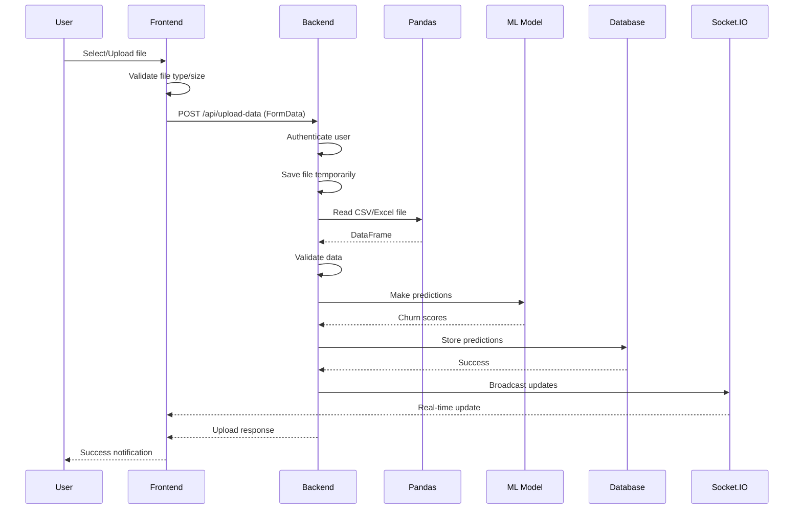

# File Upload System Documentation

## Overview

This document describes the comprehensive file upload system that allows users to upload CSV/Excel files for churn prediction analysis. The system processes files using Pandas, makes predictions with machine learning models, stores results in MySQL database, and updates the dashboard in real-time.

## Features

- **File Upload Component**: Drag-and-drop interface for CSV/Excel files
- **FormData Integration**: Secure file transmission to Flask API
- **Pandas Processing**: Advanced data processing and validation
- **ML Predictions**: Churn prediction using pre-trained models
- **Database Storage**: User-specific prediction storage in MySQL
- **Real-time Updates**: Dashboard updates via Socket.IO
- **Progress Tracking**: Upload progress and status indicators

## Architecture

### Frontend Components

#### 1. File Upload Component (`frontend/components/upload/FileUploadComponent.tsx`)

**Key Features**:
- Drag-and-drop file upload interface
- File type validation (CSV, XLS, XLSX)
- File size validation (max 10MB)
- Upload progress tracking
- Success/error feedback
- Sample file download

**Props Interface**:
```typescript
interface FileUploadComponentProps {
  onUploadSuccess?: (result: UploadResult) => void
  onUploadError?: (error: string) => void
}
```

**Upload Result Interface**:
```typescript
interface UploadResult {
  success: boolean
  message: string
  data?: {
    total_records: number
    predictions_made: number
    high_risk_count: number
    avg_churn_score: number
    file_name: string
    predictions: Array<{
      id: string
      churn_score: number
      risk_level: string
      timestamp: string
    }>
  }
  error?: string
}
```

#### 2. Settings Page Integration

**Location**: `frontend/app/settings/page.tsx`
- Integrated as "Data Upload" tab
- Toast notifications for success/error feedback
- Protected route access

### Backend Components

#### 1. Upload API Endpoint (`POST /api/upload-data`)

**Authentication**: Required (JWT token)

**Request Format**:
```
Content-Type: multipart/form-data
Authorization: Bearer <access_token>

FormData:
- file: CSV/Excel file
- user_id: User ID (optional, extracted from token)
```

**Response Format**:
```json
{
  "success": true,
  "message": "File processed successfully! 10 predictions generated.",
  "data": {
    "total_records": 10,
    "predictions_made": 10,
    "high_risk_count": 3,
    "avg_churn_score": 0.456,
    "file_name": "customer_data.csv",
    "predictions": [...]
  }
}
```

#### 2. Database Models

**ChurnPrediction Model** (`backend/models/prediction.py`):
```python
class ChurnPrediction(Base):
    __tablename__ = 'churn_predictions'
    
    id = Column(Integer, primary_key=True)
    user_id = Column(Integer, ForeignKey('users.id'))
    prediction_id = Column(String(255), unique=True)
    customer_id = Column(String(255))
    churn_score = Column(Float)
    risk_level = Column(String(50))  # 'high', 'medium', 'low'
    file_name = Column(String(255))
    status = Column(String(50))
    
    # Customer data
    age = Column(Integer)
    total_purchases = Column(Integer)
    avg_order_value = Column(Float)
    days_since_last_purchase = Column(Integer)
    email_opens = Column(Integer)
    website_visits = Column(Integer)
    
    # Metadata
    raw_data = Column(Text)
    created_at = Column(DateTime)
    updated_at = Column(DateTime)
```

**User Model Relationship**:
```python
class User(Base):
    # ... existing fields ...
    predictions = relationship("ChurnPrediction", back_populates="user")
```

## Data Processing Flow

### 1. File Upload Process



### 2. Data Processing Steps

1. **File Validation**:
   - Check file extension (.csv, .xls, .xlsx)
   - Validate file size (max 10MB)
   - Verify file is not empty

2. **Data Reading**:
   - Use Pandas to read CSV/Excel files
   - Handle different file formats
   - Parse data into DataFrame

3. **Feature Extraction**:
   - Map columns to expected features
   - Handle missing values with defaults
   - Normalize data types

4. **Prediction Generation**:
   - Apply ML model to generate churn scores
   - Determine risk levels (high/medium/low)
   - Create prediction records

5. **Database Storage**:
   - Store predictions with user association
   - Maintain data integrity
   - Handle transaction rollback on errors

6. **Real-time Updates**:
   - Broadcast new predictions via Socket.IO
   - Update dashboard metrics
   - Notify connected users

## File Format Requirements

### Supported Formats
- **CSV files** (.csv)
- **Excel files** (.xls, .xlsx)
- **Maximum size**: 10MB

### Expected Columns

**Required Columns** (with defaults if missing):
```csv
customer_id,age,total_purchases,avg_order_value,days_since_last_purchase,email_opens,website_visits
```

**Column Descriptions**:
- `customer_id`: Unique identifier (string)
- `age`: Customer age (integer, default: 30)
- `total_purchases`: Total number of purchases (integer, default: 0)
- `avg_order_value`: Average order value (float, default: 0)
- `days_since_last_purchase`: Days since last purchase (integer, default: 30)
- `email_opens`: Number of email opens (integer, default: 0)
- `website_visits`: Number of website visits (integer, default: 0)

### Sample File Format

```csv
customer_id,age,total_purchases,avg_order_value,days_since_last_purchase,email_opens,website_visits
customer_001,25,5,50.0,10,5,10
customer_002,30,10,75.0,20,10,20
customer_003,35,15,100.0,30,15,30
```

## API Reference

### Upload Endpoint

**`POST /api/upload-data`**

**Headers**:
```
Authorization: Bearer <access_token>
Content-Type: multipart/form-data
```

**Request Body**:
```
FormData:
- file: CSV/Excel file
```

**Response (Success)**:
```json
{
  "success": true,
  "message": "File processed successfully! 10 predictions generated.",
  "data": {
    "total_records": 10,
    "predictions_made": 10,
    "high_risk_count": 3,
    "avg_churn_score": 0.456,
    "file_name": "customer_data.csv",
    "predictions": [
      {
        "id": "pred_1_1234567890_0",
        "user_id": "1",
        "churn_score": 0.7234,
        "risk_level": "high",
        "timestamp": "2024-01-01T12:00:00Z",
        "file_name": "customer_data.csv",
        "status": "completed",
        "row_data": {
          "customer_id": "customer_001",
          "age": 25,
          "total_purchases": 5,
          "avg_order_value": 50.0,
          "days_since_last_purchase": 10,
          "email_opens": 5,
          "website_visits": 10
        }
      }
    ]
  }
}
```

**Response (Error)**:
```json
{
  "success": false,
  "error": "Invalid file type. Please upload CSV or Excel files only."
}
```

### Error Codes

- **400**: Bad Request (invalid file, empty file, validation errors)
- **401**: Unauthorized (missing or invalid token)
- **500**: Internal Server Error (processing errors, database errors)

## Frontend Implementation

### File Upload Component Usage

```tsx
import FileUploadComponent from '@/components/upload/FileUploadComponent'

function SettingsPage() {
  const handleUploadSuccess = (result) => {
    toast.success(result.message)
    // Refresh dashboard data
  }

  const handleUploadError = (error) => {
    toast.error(error)
  }

  return (
    <FileUploadComponent
      onUploadSuccess={handleUploadSuccess}
      onUploadError={handleUploadError}
    />
  )
}
```

### File Validation

```typescript
const validateFile = (file: File): boolean => {
  // Check file type
  const supportedTypes = [
    'text/csv',
    'application/vnd.ms-excel',
    'application/vnd.openxmlformats-officedocument.spreadsheetml.sheet'
  ]
  
  if (!supportedTypes.includes(file.type) && 
      !file.name.match(/\.(csv|xls|xlsx)$/i)) {
    return false
  }
  
  // Check file size (10MB max)
  if (file.size > 10 * 1024 * 1024) {
    return false
  }
  
  return true
}
```

### Upload Progress Tracking

```typescript
const uploadFile = async (file: File) => {
  setUploading(true)
  setUploadProgress(0)
  
  const formData = new FormData()
  formData.append('file', file)
  
  // Simulate progress updates
  const progressInterval = setInterval(() => {
    setUploadProgress(prev => {
      if (prev >= 90) {
        clearInterval(progressInterval)
        return prev
      }
      return prev + Math.random() * 10
    })
  }, 200)
  
  try {
    const response = await authApi.uploadData(formData)
    setUploadProgress(100)
    // Handle success
  } catch (error) {
    // Handle error
  } finally {
    setUploading(false)
    clearInterval(progressInterval)
  }
}
```

## Backend Implementation

### File Processing

```python
@app.route('/api/upload-data', methods=['POST'])
@token_required
def upload_data():
    try:
        # Validate file
        if 'file' not in request.files:
            return jsonify({"error": "No file provided"}), 400
        
        file = request.files['file']
        if file.filename == '':
            return jsonify({"error": "No file selected"}), 400
        
        # Check file extension
        allowed_extensions = {'csv', 'xlsx', 'xls'}
        if not ('.' in file.filename and 
                file.filename.rsplit('.', 1)[1].lower() in allowed_extensions):
            return jsonify({"error": "Invalid file type"}), 400
        
        # Save and process file
        filename = secure_filename(file.filename)
        filepath = os.path.join(app.config['UPLOAD_FOLDER'], filename)
        file.save(filepath)
        
        try:
            # Read file with Pandas
            if filename.endswith('.csv'):
                df = pd.read_csv(filepath)
            else:
                df = pd.read_excel(filepath)
            
            # Validate data
            if df.empty:
                return jsonify({"error": "File is empty"}), 400
            
            # Make predictions
            churn_scores = predict_churn_from_dataframe(df)
            
            # Create prediction records
            predictions = []
            user_id = request.current_user.id
            
            for i, (_, row) in enumerate(df.iterrows()):
                prediction = {
                    "id": f"pred_{user_id}_{timestamp}_{i}",
                    "user_id": str(user_id),
                    "churn_score": float(churn_scores[i]),
                    "risk_level": "high" if churn_scores[i] > 0.7 else "medium" if churn_scores[i] > 0.4 else "low",
                    "timestamp": datetime.utcnow().isoformat(),
                    "file_name": filename,
                    "status": "completed",
                    "row_data": {
                        "customer_id": row.get('customer_id', f"customer_{i}"),
                        "age": row.get('age', 30),
                        # ... other fields
                    }
                }
                predictions.append(prediction)
            
            # Store in database
            db = SessionLocal()
            try:
                for prediction_data in predictions:
                    prediction_record = ChurnPrediction.create_from_prediction_data(prediction_data, user_id)
                    db.add(prediction_record)
                db.commit()
            except Exception as e:
                db.rollback()
                raise e
            finally:
                db.close()
            
            # Clean up file
            os.remove(filepath)
            
            return jsonify({
                "success": True,
                "message": f"File processed successfully! {len(predictions)} predictions generated.",
                "data": {
                    "total_records": len(df),
                    "predictions_made": len(predictions),
                    "high_risk_count": len([p for p in predictions if p['risk_level'] == 'high']),
                    "avg_churn_score": sum(p['churn_score'] for p in predictions) / len(predictions),
                    "file_name": filename,
                    "predictions": predictions[:10]
                }
            })
            
        except Exception as e:
            if os.path.exists(filepath):
                os.remove(filepath)
            return jsonify({"error": f"Error processing file: {str(e)}"}), 500
            
    except Exception as e:
        return jsonify({"error": f"Upload failed: {str(e)}"}), 500
```

### Database Operations

```python
class ChurnPrediction(Base):
    # ... model definition ...
    
    @classmethod
    def create_from_prediction_data(cls, prediction_data, user_id):
        """Create a new prediction record from prediction data"""
        return cls(
            user_id=user_id,
            prediction_id=prediction_data['id'],
            customer_id=prediction_data.get('row_data', {}).get('customer_id'),
            churn_score=prediction_data['churn_score'],
            risk_level=prediction_data['risk_level'],
            file_name=prediction_data.get('file_name'),
            status=prediction_data.get('status', 'completed'),
            age=prediction_data.get('row_data', {}).get('age'),
            total_purchases=prediction_data.get('row_data', {}).get('total_purchases'),
            avg_order_value=prediction_data.get('row_data', {}).get('avg_order_value'),
            days_since_last_purchase=prediction_data.get('row_data', {}).get('days_since_last_purchase'),
            email_opens=prediction_data.get('row_data', {}).get('email_opens'),
            website_visits=prediction_data.get('row_data', {}).get('website_visits'),
            raw_data=str(prediction_data.get('row_data', {}))
        )
```

## Real-time Integration

### Socket.IO Broadcasting

```python
# In upload endpoint after successful processing
if socket_service:
    for prediction in predictions:
        socket_service.broadcast_new_prediction(prediction)
```

### Frontend Real-time Updates

```typescript
// In useRealTimeDashboard hook
socketService.setCallbacks({
  onNewPrediction: (prediction: any) => {
    console.log('New prediction received:', prediction)
    // Refresh dashboard data
    requestData()
  }
})
```

## Security Features

### 1. Authentication
- JWT token required for all uploads
- User-specific data isolation
- Token validation on every request

### 2. File Validation
- File type validation (CSV/Excel only)
- File size limits (10MB max)
- Secure filename handling
- Temporary file cleanup

### 3. Data Privacy
- User-specific prediction storage
- No cross-user data access
- Secure file processing
- Database transaction integrity

### 4. Error Handling
- Comprehensive error messages
- Graceful failure handling
- File cleanup on errors
- Database rollback on failures

## Performance Considerations

### 1. File Processing
- Efficient Pandas operations
- Memory-conscious data processing
- Batch database operations
- Temporary file management

### 2. Database Optimization
- Indexed user_id and prediction_id
- Efficient queries for user data
- Connection pooling
- Transaction management

### 3. Real-time Updates
- Selective broadcasting to users
- Efficient Socket.IO messaging
- Minimal data transfer
- Connection management

## Testing

### Test Coverage

**Backend Tests** (`backend/test_file_upload.py`):
- Valid file uploads (CSV, Excel)
- Invalid file handling
- Authentication validation
- Database storage verification
- Dashboard integration

**Frontend Tests**:
- File validation
- Upload progress tracking
- Error handling
- Success feedback
- Real-time updates

### Manual Testing Checklist

1. **File Upload**:
   - [ ] CSV file upload works
   - [ ] Excel file upload works
   - [ ] File validation works
   - [ ] Progress tracking works
   - [ ] Success/error feedback works

2. **Data Processing**:
   - [ ] Pandas processing works
   - [ ] ML predictions generated
   - [ ] Database storage works
   - [ ] User-specific data isolation

3. **Real-time Updates**:
   - [ ] Dashboard updates automatically
   - [ ] Socket.IO broadcasting works
   - [ ] User-specific updates only

4. **Error Handling**:
   - [ ] Invalid files rejected
   - [ ] Authentication required
   - [ ] Error messages clear
   - [ ] File cleanup on errors

## Deployment Considerations

### 1. File Storage
- Temporary file directory setup
- File cleanup procedures
- Storage space monitoring
- Backup strategies

### 2. Database Setup
- Prediction table creation
- Index optimization
- Connection configuration
- Migration scripts

### 3. Security Configuration
- File upload limits
- CORS settings
- Authentication middleware
- Error message sanitization

## Troubleshooting

### Common Issues

#### 1. File Upload Failures
**Symptoms**: Files not uploading or processing
**Solutions**:
- Check file format and size
- Verify authentication token
- Check server logs for errors
- Ensure upload directory exists

#### 2. Processing Errors
**Symptoms**: Files upload but processing fails
**Solutions**:
- Check file format and columns
- Verify ML model is loaded
- Check database connection
- Review error logs

#### 3. Database Issues
**Symptoms**: Predictions not stored
**Solutions**:
- Check database connection
- Verify table structure
- Check user permissions
- Review transaction logs

#### 4. Real-time Updates Not Working
**Symptoms**: Dashboard not updating
**Solutions**:
- Check Socket.IO connection
- Verify broadcasting logic
- Check user authentication
- Review network connectivity

### Debug Mode

**Enable Debug Logging**:
```python
import logging
logging.basicConfig(level=logging.DEBUG)
```

**Debug Commands**:
```bash
# Check uploaded files
ls -la backend/uploads/

# Check database predictions
mysql -u root -p churn_db -e "SELECT COUNT(*) FROM churn_predictions;"

# Check server logs
tail -f backend/logs/app.log
```

## Future Enhancements

### 1. Advanced Features
- **Batch Processing**: Multiple file uploads
- **Data Validation**: Advanced column validation
- **Export Functionality**: Download processed results
- **Scheduling**: Automated file processing

### 2. Performance Improvements
- **Async Processing**: Background file processing
- **Caching**: Prediction result caching
- **Compression**: File compression support
- **Streaming**: Large file streaming

### 3. User Experience
- **Drag & Drop**: Enhanced drag-and-drop interface
- **Preview**: File content preview
- **Templates**: File format templates
- **History**: Upload history tracking

## Conclusion

The file upload system provides a comprehensive solution for processing customer data files with churn prediction analysis. It features secure file handling, efficient data processing, real-time updates, and robust error handling, making it suitable for production use in customer analytics applications.
