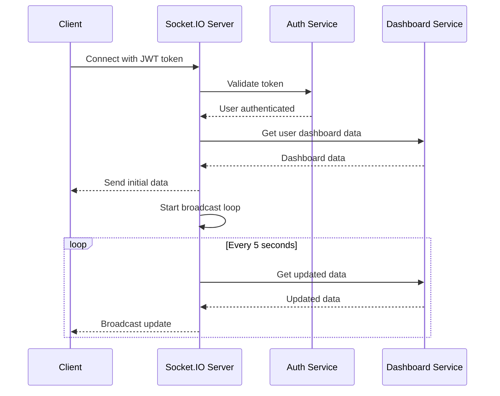
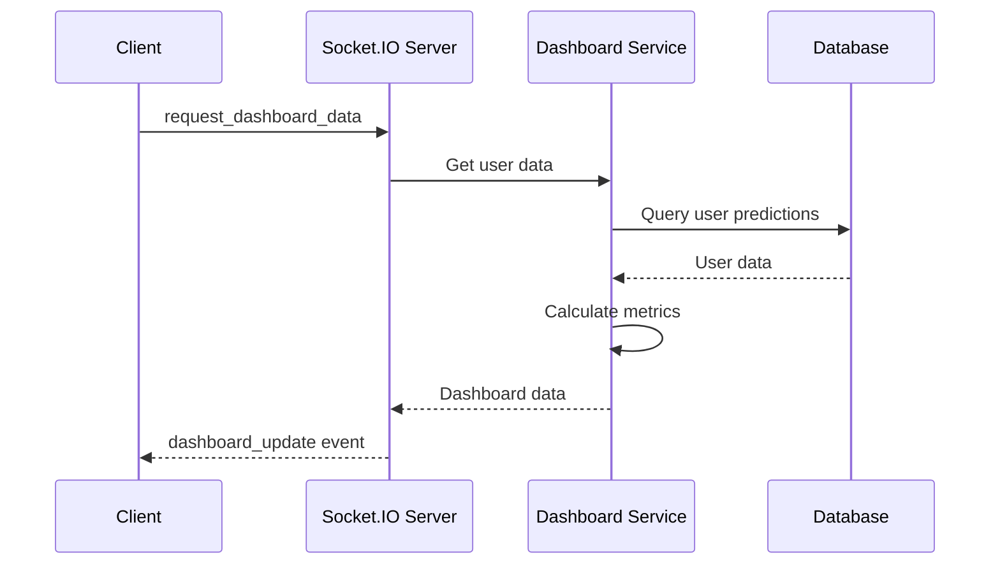
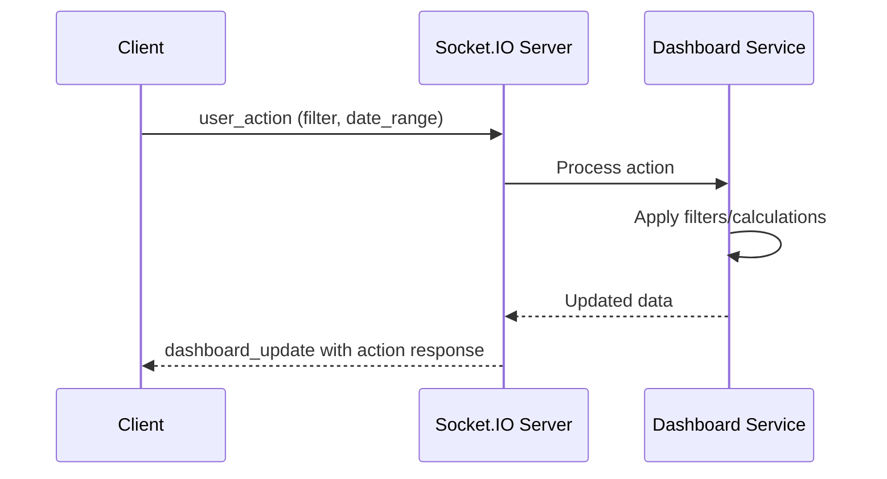

# Socket.IO Real-Time Dashboard Documentation

## Overview

This document describes the real-time dashboard functionality using Socket.IO for live data streaming, user-specific metrics, and dynamic dashboard updates.

## Features

- **Real-Time Communication**: Socket.IO WebSocket connection for instant data updates
- **User-Specific Metrics**: Personalized dashboard data based on authenticated user
- **Live Data Streaming**: Automatic updates every 5 seconds
- **Connection Management**: Auto-reconnection and offline fallback
- **Loading States**: Spinners and placeholders during data fetching
- **Interactive Actions**: User actions (filtering, date ranges) sent via Socket.IO

## Architecture

### Backend Components

#### 1. Socket.IO Service (`backend/services/socket_service.py`)

**Key Features**:
- User authentication via JWT tokens
- Real-time data broadcasting
- User-specific room management
- Dashboard data aggregation

**Main Methods**:
```python
class SocketService:
    def authenticate_user(self, token)
    def get_user_dashboard_data(self, user_id)
    def start_data_broadcast(self)
    def handle_connect(self, auth=None)
    def handle_disconnect(self)
    def handle_request_dashboard_data(self, data)
    def handle_user_action(self, data)
```

#### 2. Socket.IO Event Handlers (`backend/app.py`)

**Events**:
- `connect` - Client connection with authentication
- `disconnect` - Client disconnection
- `request_dashboard_data` - Request for dashboard data
- `user_action` - User actions (filtering, etc.)

#### 3. Live Data API Endpoint

**Endpoint**: `GET /api/live-data`
- **Authentication**: Required (JWT token)
- **Response**: User-specific dashboard data
- **Fallback**: Used when Socket.IO is unavailable

### Frontend Components

#### 1. Socket Service (`frontend/lib/socketService.ts`)

**Features**:
- Singleton pattern for connection management
- Automatic reconnection with exponential backoff
- Event callback system
- Connection status monitoring

**Key Methods**:
```typescript
class SocketService {
  connect(token: string): Promise<boolean>
  disconnect(): void
  requestDashboardData(): void
  sendUserAction(action: string, data?: any): void
  setCallbacks(callbacks: SocketServiceCallbacks): void
}
```

#### 2. Real-Time Dashboard Hook (`frontend/hooks/useRealTimeDashboard.ts`)

**Features**:
- React hook for managing real-time data
- Automatic Socket.IO connection management
- Fallback to API polling
- Loading and error state management

**Return Values**:
```typescript
interface UseRealTimeDashboardReturn {
  dashboardData: DashboardData | null
  loading: boolean
  error: string | null
  connectionStatus: string
  isConnected: boolean
  requestData: () => void
  sendAction: (action: string, data?: any) => void
  refreshData: () => Promise<void>
}
```

#### 3. Dashboard Components

**RealTimeDashboardCards** (`frontend/components/dashboard/RealTimeDashboardCards.tsx`):
- Displays real-time metrics
- Connection status indicator
- Loading states and animations
- User-specific data visualization

## Data Flow

### 1. Connection Flow



### 2. Data Update Flow



### 3. User Action Flow



## Data Structure

### Dashboard Data Format

```typescript
interface DashboardData {
  user_id: number
  timestamp: string
  metrics: {
    total_predictions: number
    avg_churn_score: number
    high_risk_predictions: number
    low_risk_predictions: number
    medium_risk_predictions: number
    engagement_score: number
    retention_rate: number
    active_users_today: number
    new_predictions_today: number
  }
  recent_activity: Array<{
    id: string
    user_id: string
    churn_score: number
    risk_level: string
    timestamp: string
    file_name?: string
    status: string
  }>
  trends: {
    churn_trend: 'increasing' | 'stable' | 'decreasing'
    engagement_trend: 'increasing' | 'stable' | 'decreasing'
    retention_trend: 'increasing' | 'stable' | 'decreasing'
  }
  alerts: Array<{
    type: 'critical' | 'warning' | 'info'
    message: string
    timestamp: string
  }>
}
```

## Real-Time Features

### 1. Automatic Updates

- **Frequency**: Every 5 seconds
- **Scope**: User-specific data only
- **Efficiency**: Only sends changed data
- **Fallback**: API polling if Socket.IO fails

### 2. Connection Management

- **Auto-reconnection**: Exponential backoff (1s, 2s, 4s, 8s, 16s)
- **Max attempts**: 5 reconnection attempts
- **Status monitoring**: Real-time connection status
- **Graceful degradation**: Falls back to API polling

### 3. User Actions

**Supported Actions**:
- `filter` - Filter data by criteria
- `date_range` - Set date range for data
- `refresh` - Manual data refresh
- `export` - Export dashboard data

**Action Format**:
```typescript
{
  action: string
  data?: any
  timestamp: string
}
```

## Loading States

### 1. Connection States

- **Connecting**: Initial connection attempt
- **Connected**: Successfully connected and authenticated
- **Disconnected**: Connection lost
- **Error**: Connection or authentication error

### 2. Data States

- **Loading**: Initial data fetch or refresh
- **Loaded**: Data successfully loaded
- **Error**: Failed to load data
- **Refreshing**: Manual refresh in progress

### 3. UI Indicators

**Connection Status**:
```tsx
<div className={`flex items-center space-x-2 px-3 py-2 rounded-lg ${
  isConnected 
    ? 'bg-green-100 text-green-800' 
    : 'bg-red-100 text-red-800'
}`}>
  {isConnected ? <Activity className="h-4 w-4" /> : <WifiOff className="h-4 w-4" />}
  <span className="text-sm font-medium">
    {isConnected ? 'Live' : 'Offline'}
  </span>
</div>
```

**Loading Spinner**:
```tsx
<motion.div
  animate={{ rotate: 360 }}
  transition={{ duration: 1, repeat: Infinity, ease: 'linear' }}
  className="w-12 h-12 border-4 border-blue-200 border-t-blue-600 rounded-full mx-auto mb-4"
/>
```

## Security Features

### 1. Authentication

- **JWT Token Validation**: All Socket.IO connections require valid JWT
- **User Isolation**: Users only receive their own data
- **Token Expiration**: Automatic disconnection on token expiry

### 2. Data Privacy

- **User-Specific Rooms**: Each user joins their own room
- **Data Filtering**: Only user's own predictions are included
- **Secure Broadcasting**: No cross-user data leakage

### 3. Connection Security

- **CORS Configuration**: Proper CORS settings for Socket.IO
- **Transport Security**: WebSocket and polling transports
- **Error Handling**: Secure error messages without sensitive data

## Performance Optimization

### 1. Backend Optimizations

- **Database Indexing**: Optimized queries for user data
- **Connection Pooling**: Efficient database connections
- **Broadcast Efficiency**: Only broadcast to connected users
- **Data Caching**: Cache frequently accessed data

### 2. Frontend Optimizations

- **Connection Reuse**: Single Socket.IO connection per user
- **Data Debouncing**: Prevent excessive updates
- **Component Memoization**: Optimize re-renders
- **Lazy Loading**: Load dashboard components on demand

### 3. Network Optimizations

- **Compression**: Socket.IO message compression
- **Batch Updates**: Group multiple updates together
- **Selective Broadcasting**: Only send relevant data
- **Connection Limits**: Prevent connection flooding

## Error Handling

### 1. Connection Errors

```typescript
// Connection error handling
this.sio.on('connect_error', (error: Error) => {
  console.error('Socket.IO connection error:', error)
  this.reconnectAttempts++
  if (this.reconnectAttempts >= this.maxReconnectAttempts) {
    this.callbacks.onError?.('Connection failed after multiple attempts')
  }
})
```

### 2. Authentication Errors

```typescript
// Authentication error handling
this.sio.on('connected', (data: { status: string; message: string }) => {
  if (data.status === 'success') {
    console.log('Socket.IO authentication successful')
  } else {
    console.error('Socket.IO authentication failed:', data.message)
    this.callbacks.onError?.(data.message)
  }
})
```

### 3. Data Errors

```typescript
// Data error handling
this.sio.on('error', (error: { message: string }) => {
  console.error('Socket.IO error:', error.message)
  this.callbacks.onError?.(error.message)
})
```

## Testing

### 1. Backend Testing

**Test Script**: `backend/test_socketio.py`

**Test Coverage**:
- Socket.IO connection and authentication
- Dashboard data broadcasting
- User action handling
- Live data API endpoint
- Error handling and reconnection

**Run Tests**:
```bash
cd backend
python test_socketio.py
```

### 2. Frontend Testing

**Manual Testing Checklist**:
- [ ] Socket.IO connection on page load
- [ ] Real-time data updates every 5 seconds
- [ ] Connection status indicator
- [ ] Loading states during data fetch
- [ ] Error handling for connection failures
- [ ] Auto-reconnection after network issues
- [ ] User action sending and response
- [ ] Fallback to API polling when offline

### 3. Integration Testing

**Test Scenarios**:
1. **Normal Operation**: User connects, receives data, actions work
2. **Network Interruption**: Connection lost, auto-reconnection works
3. **Authentication Expiry**: Token expires, graceful disconnection
4. **High Load**: Multiple users, performance remains stable
5. **Error Recovery**: Server restart, clients reconnect automatically

## Deployment Considerations

### 1. Production Setup

**Environment Variables**:
```bash
# Backend
FLASK_ENV=production
DB_HOST=your-db-host
DB_PASSWORD=your-db-password
SECRET_KEY=your-secret-key

# Frontend
NEXT_PUBLIC_API_URL=https://your-api-domain.com
```

**Server Configuration**:
- **Load Balancer**: Sticky sessions for Socket.IO
- **Redis**: For Socket.IO scaling (if needed)
- **SSL/TLS**: Secure WebSocket connections
- **Firewall**: Allow WebSocket traffic

### 2. Scaling Considerations

**Horizontal Scaling**:
- Use Redis adapter for Socket.IO clustering
- Load balancer with sticky sessions
- Database connection pooling
- CDN for static assets

**Vertical Scaling**:
- Increase server resources
- Optimize database queries
- Implement caching layers
- Monitor performance metrics

### 3. Monitoring

**Key Metrics**:
- Socket.IO connection count
- Message throughput
- Connection duration
- Error rates
- Response times

**Monitoring Tools**:
- Application performance monitoring (APM)
- Real-time dashboards
- Log aggregation
- Alert systems

## Troubleshooting

### Common Issues

#### 1. Connection Failures

**Symptoms**: Cannot connect to Socket.IO server
**Solutions**:
- Check server is running on correct port
- Verify CORS settings
- Check firewall/network configuration
- Validate JWT token

#### 2. Authentication Errors

**Symptoms**: Connection established but authentication fails
**Solutions**:
- Verify JWT token is valid and not expired
- Check token format and secret key
- Ensure user exists in database
- Check token generation logic

#### 3. No Data Updates

**Symptoms**: Connected but no real-time updates
**Solutions**:
- Check broadcast loop is running
- Verify user has data in database
- Check Socket.IO event handlers
- Monitor server logs for errors

#### 4. Performance Issues

**Symptoms**: Slow updates or high CPU usage
**Solutions**:
- Optimize database queries
- Implement data caching
- Reduce broadcast frequency
- Monitor connection count

### Debug Mode

**Enable Debug Logging**:
```python
# Backend
import logging
logging.basicConfig(level=logging.DEBUG)

# Frontend
localStorage.setItem('debug', 'socket.io-client:*')
```

**Debug Commands**:
```bash
# Check Socket.IO connections
netstat -an | grep :5000

# Monitor WebSocket traffic
tcpdump -i any port 5000

# Check server logs
tail -f backend/logs/app.log
```

## Future Enhancements

### 1. Advanced Features

- **Real-time Notifications**: Push notifications for alerts
- **Collaborative Features**: Multi-user dashboard sharing
- **Advanced Filtering**: Complex filter combinations
- **Data Export**: Real-time data export functionality

### 2. Performance Improvements

- **Data Compression**: Compress large datasets
- **Incremental Updates**: Send only changed data
- **Predictive Loading**: Pre-load likely needed data
- **Offline Support**: Cache data for offline viewing

### 3. User Experience

- **Customizable Dashboards**: User-defined layouts
- **Theme Support**: Dark/light mode switching
- **Accessibility**: Screen reader support
- **Mobile Optimization**: Touch-friendly interface

## API Reference

### Socket.IO Events

#### Client → Server

**`connect`**
- **Auth**: `{ token: string }`
- **Response**: `connected` event

**`request_dashboard_data`**
- **Data**: `{}`
- **Response**: `dashboard_update` event

**`user_action`**
- **Data**: `{ action: string, data?: any, timestamp: string }`
- **Response**: `dashboard_update` event

#### Server → Client

**`connected`**
- **Data**: `{ status: 'success' | 'error', message: string }`

**`dashboard_update`**
- **Data**: `DashboardData` object

**`system_alert`**
- **Data**: `{ type: string, message: string, timestamp: string }`

**`new_prediction`**
- **Data**: Prediction object

**`error`**
- **Data**: `{ message: string }`

### REST API Endpoints

**`GET /api/live-data`**
- **Headers**: `Authorization: Bearer <token>`
- **Response**: `{ success: boolean, data: DashboardData }`

## Conclusion

The Socket.IO real-time dashboard provides a robust, scalable solution for live data streaming with comprehensive error handling, security features, and performance optimizations. The system is designed to handle production workloads while providing an excellent user experience with real-time updates and responsive interactions.
